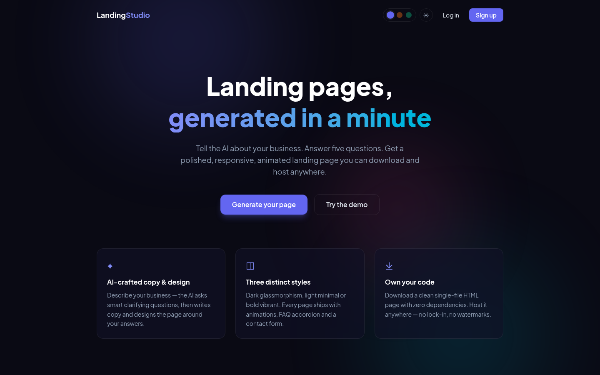
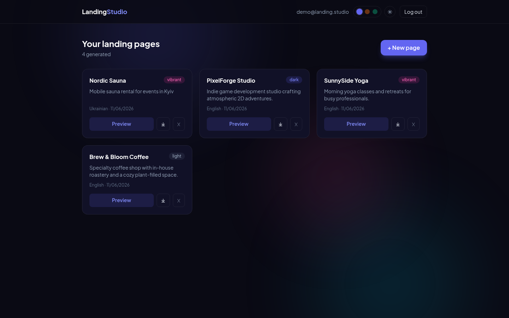
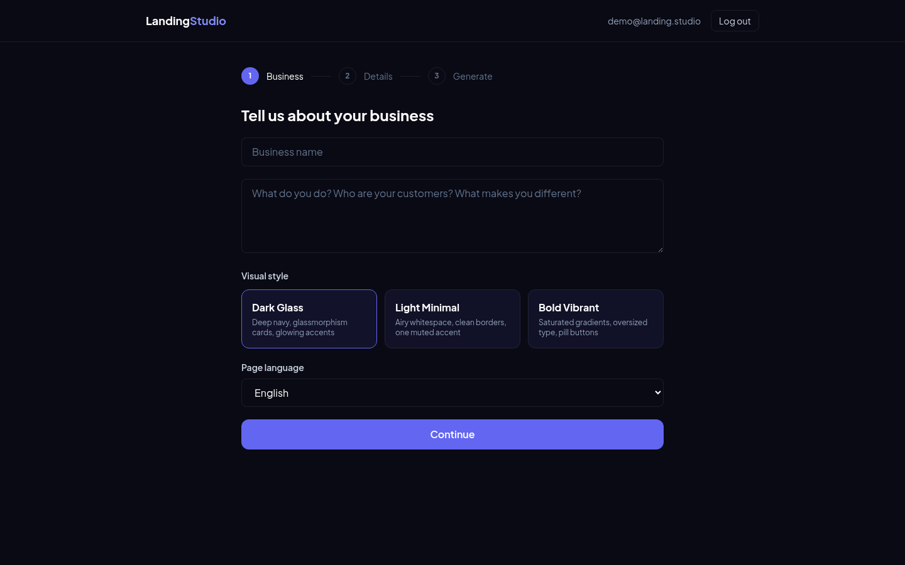
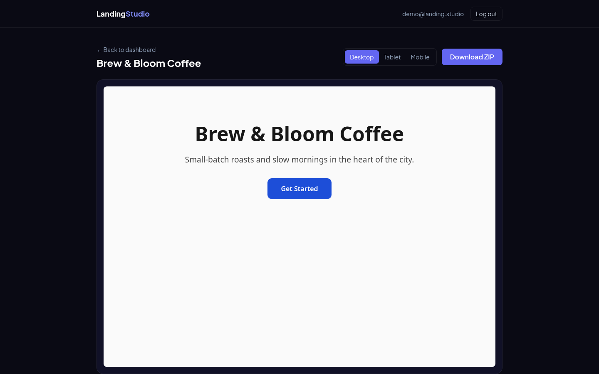
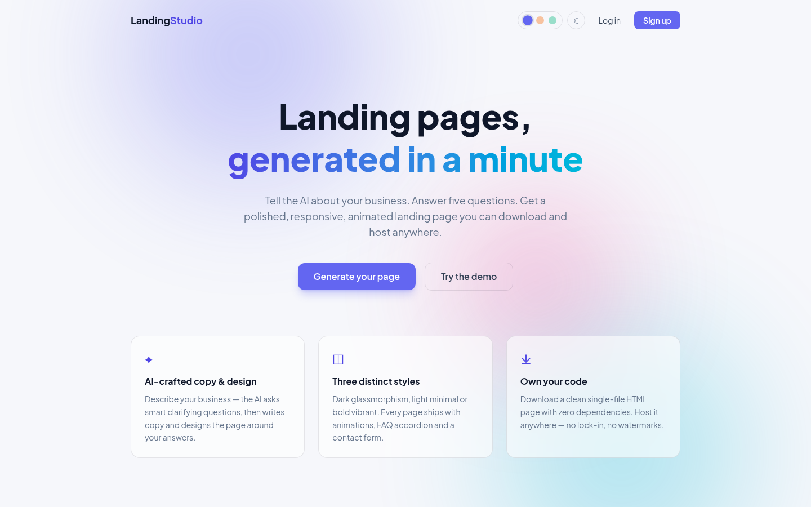
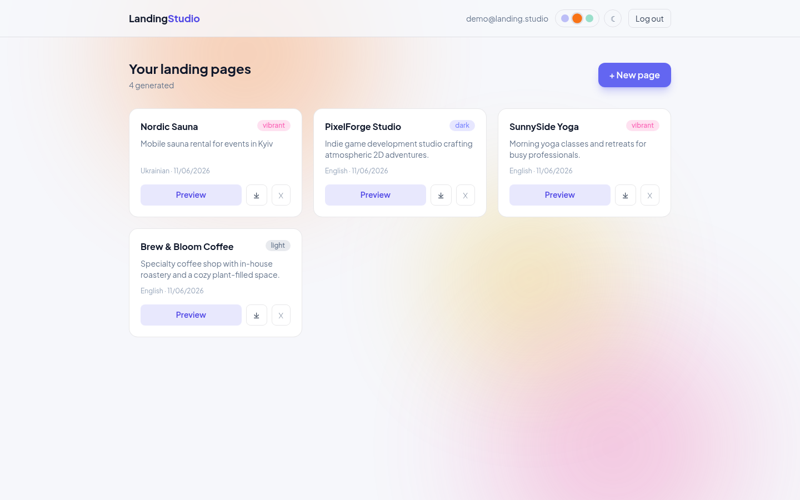

# Landing Studio


[](https://landing-studio-bohdan.fly.dev)

**Live demo:** https://landing-studio-bohdan.fly.dev

AI-powered SaaS that generates complete, animated, responsive landing pages from a short business description — with accounts, live streaming generation, history and one-click code export.



## How it works

1. **Describe your business** — name, what you do, pick one of 3 visual styles and the page language.
2. **Answer 5 AI questions** — the AI asks clarifying questions about your audience, tone and goals (all optional).
3. **Get your page** — a polished single-file HTML landing with animations, FAQ accordion and contact form. Preview it on desktop/tablet/mobile and download as ZIP.

| Dashboard | Generator wizard | Preview |
|---|---|---|
|  |  |  |

| Light theme | Light + sunset scheme |
|---|---|
|  |  |

## Features

- **Auth & workspaces** — email/password accounts (bcrypt + JWT), every user sees only their own pages
- **Animated aurora background** — pure-CSS floating gradient orbs (zero image weight), with dark/light theme toggle and 3 selectable color schemes (indigo / sunset / emerald), persisted per user in localStorage
- **Demo mode** — "Try demo" button logs into a pre-seeded account, no sign-up needed
- **3 visual styles** — dark glassmorphism, light minimal, bold vibrant
- **Any language** — UI in English, generated pages in English, Ukrainian, German, Polish, Spanish…
- **Generation history** — every page is saved; re-open, preview, download or delete anytime
- **Code export** — download a clean, dependency-free single HTML file as ZIP
- **Responsive preview** — desktop / tablet / mobile toggle in an embedded sandbox
- **Two AI models** — GPT-OSS 120B (best quality) or Llama 4 Scout (fastest), selectable per generation
- **Live streaming** — watch the AI write your page token-by-token in a live preview (SSE)
- **Production hardening** — output validation with auto-retry, per-user daily rate limits, request logging, `/api/health`, Alembic migrations, Postgres-ready (SQLite by default)

## Tech stack

| Layer | Tech |
|---|---|
| Backend | FastAPI, SQLAlchemy 2 + Alembic (SQLite / PostgreSQL), PyJWT, bcrypt |
| AI | Groq — `openai/gpt-oss-120b` + `llama-4-scout` (streaming) |
| Frontend | React 19, Vite, Tailwind CSS 4, React Router |
| Tests | pytest (12 tests: auth, generations CRUD, access isolation) |
| Deploy | Fly.io (single machine, SQLite on persistent volume) |

## Run locally

```bash
# backend
python -m venv .venv && source .venv/bin/activate
pip install -r requirements.txt
cp .env.example .env          # add your free Groq key: https://console.groq.com
python -m backend.seed_demo   # creates the demo account
uvicorn backend.main:app --port 8011

# frontend (dev mode, in another terminal)
cd frontend
npm install
npm run dev                   # http://localhost:5173, proxies /api to :8011
```

For a production-style run, build the SPA and let FastAPI serve it:

```bash
cd frontend && npm run build && cd ..
uvicorn backend.main:app --port 8011   # http://localhost:8011
```

## Tests

```bash
python -m pytest tests/
```

AI calls are mocked in tests — no API key or tokens needed.

## API overview

| Method | Endpoint | Description |
|---|---|---|
| POST | `/api/auth/register` · `/login` · `/demo` | Get a JWT |
| GET | `/api/auth/me` | Current user |
| GET | `/api/health` · `/api/models` | Service health, available AI models |
| POST | `/api/clarify` | 5 AI clarifying questions |
| POST | `/api/generate` | Generate & save a landing page |
| POST | `/api/generate/stream` | Same, streamed as SSE for live preview |
| GET/DELETE | `/api/generations[/{id}]` | History CRUD |
| GET | `/api/generations/{id}/download` | ZIP export |

## Notes

- `DATABASE_URL` switches the database (defaults to local SQLite; `render.yaml` provisions free Postgres). Schema is managed by Alembic: `alembic upgrade head`.
- `GROQ_MODEL` sets the default model key (`gpt-oss` or `scout`); users can override per generation in the UI.
- Daily limits: 20 generations per user, 5 for the demo account.
- The demo account is re-seeded on every restart (`python -m backend.seed_demo`).
